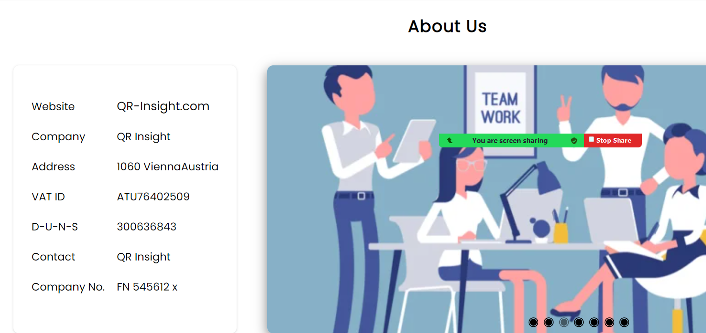
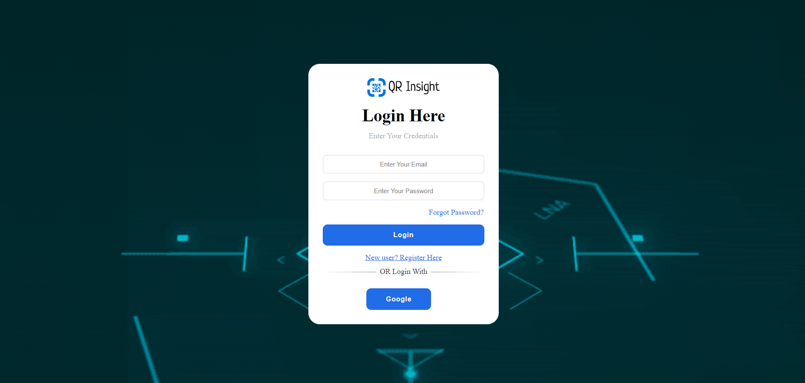
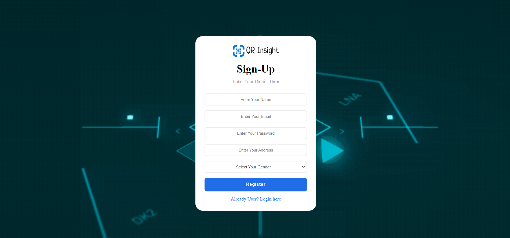
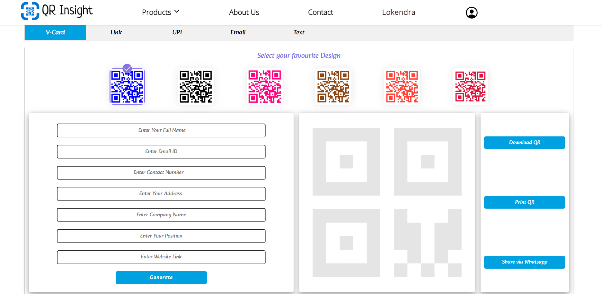
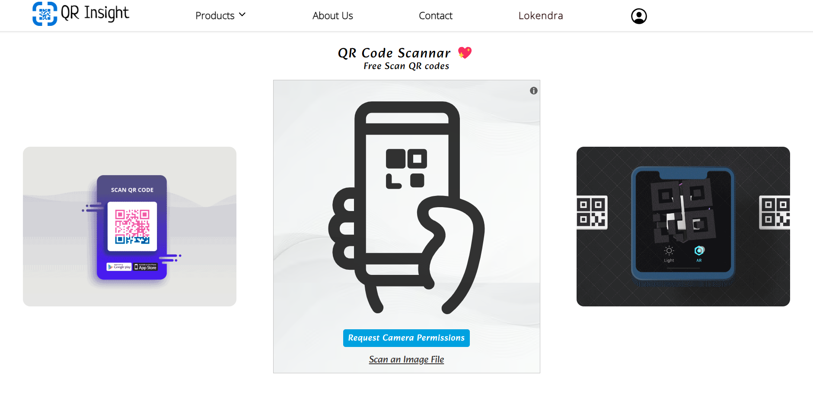
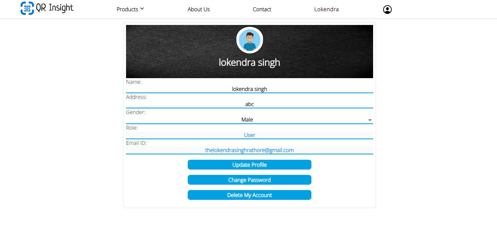
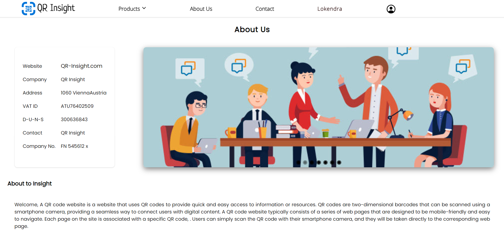
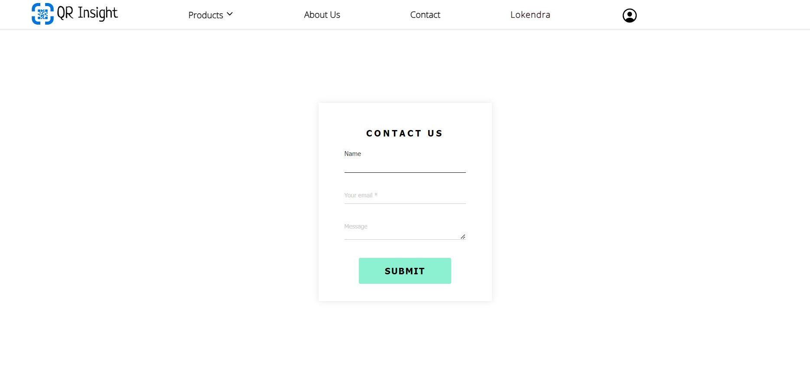

# QR-Insight
# Logo 

# QR Code Generator, Scanner and Analysis
  It is a web application that allows   users to generate and scan QR codes, as well as provide analysis on QR code usage. 

# Prerequisites
  - Node.js
  - npm modules
  - MongoDB
  - Redis
  - Git
  
# Installation
  - Clone the repository: git clone : https://github.com/Lokendra-debug/QR-Insight-full.git
  - Install dependencies: npm install
  - Start the server: npm run server
  
# Features

  - This project has the following features:

    - QR Code Generation
    - QR Code Scanner
    - QR Code Analysis
    - Download and Sharing
    - User Accounts
    - About Us Page
    - Contact Page
    - Good UI
    - Responsiveness
    - User-friendly
  
 # Table of contents
 
  ## QR-Insight/

  - backend/
    - config/
       - database.js
    - controllers/
       - QRController.js
       - userController.js
    - middlewares/
       - authentication.js
       - authorization.js
    - models/
       - userModel.js
       - QRModel.js
    - routes/
       - QRRoutes.js
       - userRoutes.js
    - index.js

  -  frontend/
     - public/
     - src/
     - css/
     - index.html
  - node_modules/
  - gitignore
  - package.json
  - README.md

  ## Home Page

 
  
  
  ## Sign In / Sign Up Page

  The OAuth and GitHub Authentication features allow users to sign up and log in to the website using their Google or GitHub accounts.

  
  

  ## QR Code Generator Page

  The QR Code Generator page allows users to generate QR codes for text, URL, Wi-Fi, Zoom, WhatsApp, phone, vCard, and email. Users can     also download, print, or share the generated QR code via email or WhatsApp.

  
  

  ## QR Scanner and Analysis Page

  The QR Scanner page allows users to scan QR codes using their device's camera or by uploading an image. The Scanner and Analysis page     provides statistical data and analysis on the usage of generated QR codes. 

  
  
  ## User Profile Section

  The User Profile section allows users to view their profile information, update their profile picture, and change their password.

  

  ## About Us Page

  The About Us page provides information about the project and the team behind it.

  

  ## Contact Page

  The Contact page provides users with a form to contact the website's administrators.

  

  # Technologies Used

    This project was built using the following technologies:

   - Node.js
   - Express.js
   - MongoDB
   - Mongoose
   - Redis
   - HTML
   - CSS
   - Bootstrap
   - JavaScript
   - qrcode
   - html5qr code
   - Socket.io
   - bcrypt
   - JWT
   - OAuth
   - GitHub auth
    
  # Deployment

  - The backend of this project has been deployed using Cyclick, and the front end has been deployed using Netlify.
     - Netlify :  https://glistening-kringle-f6d59c.netlify.app/
     - BackEnd :  https://confused-mite-bandanna.cyclic.app
     - Github  :  https://github.com/Lokendra-debug/QR-Insight-full

  # License

    This project is licensed under the MIT License. See the LICENSE file for details.
